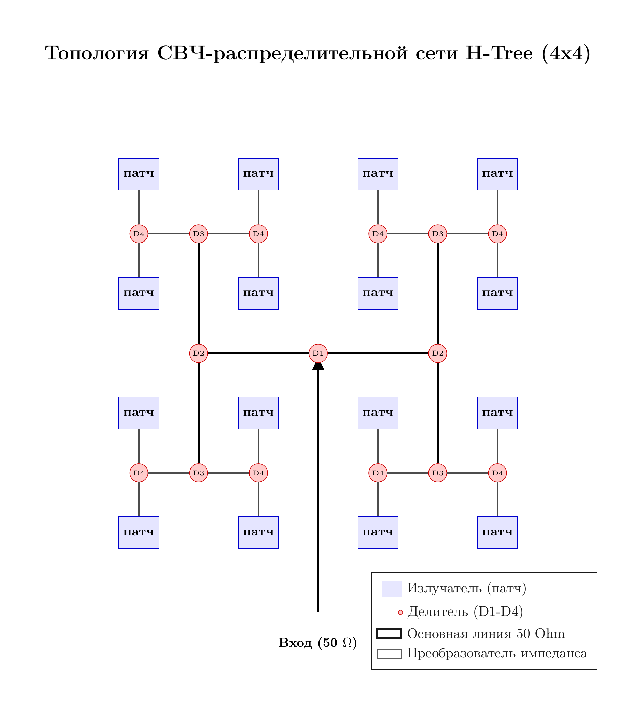
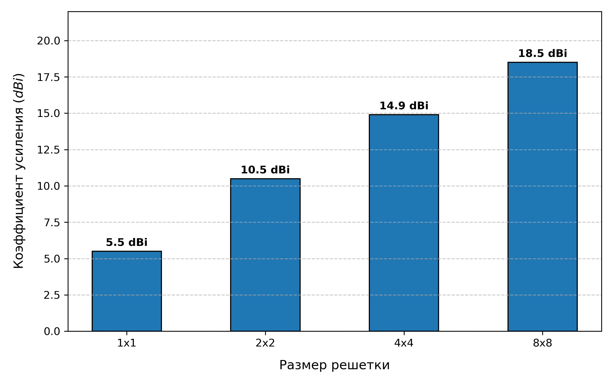
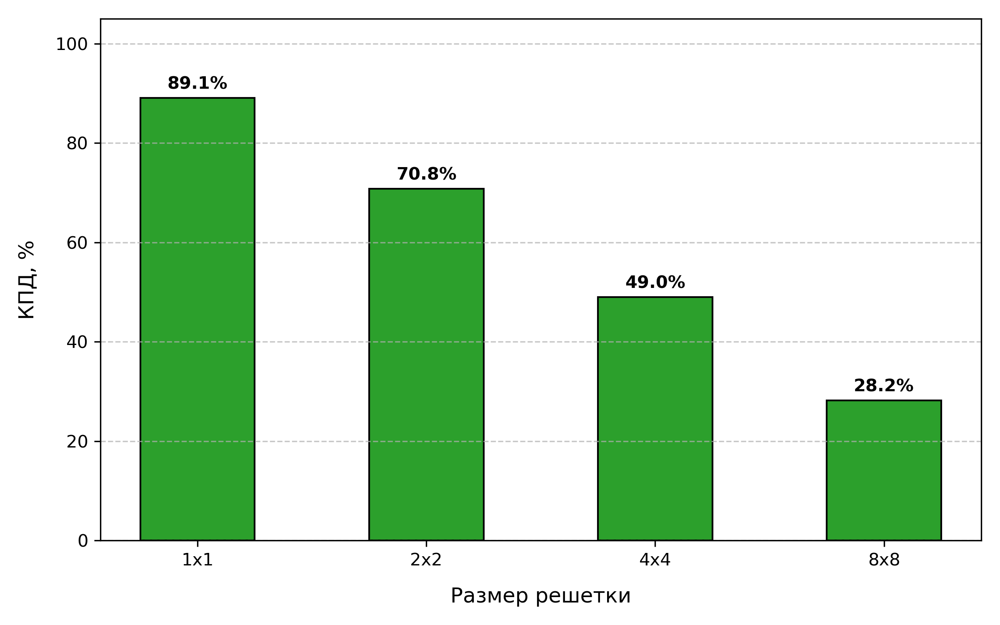

#+TITLE: Расчет параметров микрополосковых патч-антенных решеток на 10 ГГц
#+OPTIONS: toc:nil num:t todo:nil author:nil
#+STARTUP: showall
#+LATEX_HEADER: \usepackage[T2A]{fontenc}
#+LATEX_HEADER: \usepackage[utf8]{inputenc}
#+LATEX_HEADER: \usepackage[russian]{babel}
#+LATEX_HEADER: \usepackage[top=2cm, bottom=2cm, left=3cm, right=1.5cm]{geometry}

* Введение
В данном отчете представлены расчеты и оценки параметров
микрополосковых патч-антенных решеток, работающих на частоте
*10~ГГц*. В качестве материала подложки выбран СВЧ-диэлектрик *Rogers
RO4350B*. Приведено обоснование выбора оптимальной архитектуры решетки
(субмассивов) на основе баланса между направленностью и потерями в
распределительной системе для простейшего случая равной мощности на
каждом из элементов.

* 1. Параметры единичного патч-излучателя
Расчет выполнен для прямоугольного полуволнового патч-антенного
элемента со следующими физическими и конструктивными параметрами:

- *Рабочая частота ($f$):* 10 ГГц
- *Длина волны в свободном пространстве ($\lambda_0$):* 30 мм
- *Материал подложки:* Rogers RO4350B
  - Диэлектрическая проницаемость ($\varepsilon_r$): 3.48
  - Тангенс угла диэлектрических потерь ($\tan\delta$): 0.0037
- *Толщина металлизации (медь):* 18 мкм (0.5 oz)
- *Рекомендуемая толщина подложки ($h$):* 0.762 мм (30 mils)
  /Примечание: Использование более тонких подложек (например, 10 mils)
  крайне не рекомендуется, так как это снижает эффективность
  одиночного элемента до 65-70% из-за возрастания добротности
  (Q-factor) резонатора./
- *Питание патч-антенны:* через слоты (апертуры) в "земляном" полигоне
- *Размер патча (сторона квадрата $W$):* ~8 мм (определяет резонанс на
  частоте 10 ГГц, служит для генерации круговой поляризации)

** Эффективность и потери элемента
- Диэлектрическая эффективность ($\eta_d$): ~99.6%
- Проводниковая эффективность ($\eta_c$) с учетом шероховатости меди: ~96-97%
- Потери на поверхностные волны: ~3-5%
- *Полная радиационная эффективность одиночного патча
  ($\eta_{\text{patch}}$):* *87% -- 90%* (потери порядка *-0.45...-0.6
  дБ*)

* 2. Потери в элементах делительной цепи (на 10 ГГц)
При делении мощности в бинарной корпоративной схеме на частоте 10 ГГц
используются два основных типа делителей. Каждый имеет свои
компромиссы между потерями и развязкой каналов:

#+CAPTION: Структурная схема распределительной сети «H-дерева» для решетки 4x4 элементов
#+LABEL: fig:htree_4x4
#+ATTR_HTML: :width 550px :align center
#+ATTR_LATEX: :width 0.7\textwidth :alignment center

*** Реактивные Y-переходы (Y-Junctions)
- *Конструкция:* Простое разветвление линии 50 Ом на две линии с более
  высоким импедансом (с последующей трансформацией).
- *Вносимые потери (Insertion Loss):* *~0.15 дБ* на один переход.
- *Минусы:* Полное отсутствие развязки (изоляции) между выходными
  портами. Любое рассогласование одного патча влияет на соседние,
  искажая диаграмму направленности.

*** Делители Вилкинсона (Wilkinson Power Dividers)
- *Конструкция:* Разветвление с использованием балансного
  SMD-резистора (100 Ом, типоразмер 0201 для минимизации паразитных
  емкостей).
- *Вносимые потери (Insertion Loss):* *~0.35 дБ* на один делитель.
- *Плюсы:* Отличная изоляция каналов (>= 20 дБ). Отраженная от
  рассогласованных патчей мощность поглощается резистором и не портит
  общую ДН. Возможность корректировки коэффициента деления и
  коэффициента трансформации волнового сопротивления.

* 3. Потери в подводящих микрополосковых линиях
На частоте 10 ГГц потери в самих линиях передачи становятся
доминирующими при увеличении геометрических размеров платы.

- *Погонные потери ($\alpha_{\text{line}}$) для RO4350B:* *~0.2 дБ/см*
- *Скин-эффект:* На 10 ГГц глубина скин-слоя в меди составляет всего
  *0.66 мкм*. Ток течет по самой поверхности, и микроскопическая
  шероховатость подложки RO4350B (RMS ~1.1 мкм) эффективно удваивает
  поверхностное сопротивление.
- *Правило топологии:* Шаг размещения элементов (расстояние между
  центрами патчей) принимается равным (в худшем случае) $\lambda_0/2 =
  \mathbf{15\text{ мм}}$, чтобы избежать появления паразитных лепестков.

* 4. Сводный расчет и анализ антенных решеток
Расчет выполнен по симметричной схеме «H-дерева» (H-Tree),
обеспечивающей идеальную синфазность питания всех элементов. Полные
потери включают в себя затухание в микрополосках и потери на всех каскадах
деления (на примере мостов Вилкинсона).

#+NAME: tbl-antenna-analysis
| Конф. | $N_{patch}$ | каскадов | $L_{avg}$, см |   Потери в |     Потери сети |    Потери |     Полные |
|       |             |  деления |               | линиях, дБ | (Вилкинсон, дБ) | патча, дБ | потери, дБ |
|-------+-------------+----------+---------------+------------+-----------------+-----------+------------|
|   1x1 |           1 |        0 |           0.0 |        0.0 |             0.0 |       0.5 |        0.5 |
|   2x2 |           4 |        2 |           1.5 |        0.3 |             0.7 |       0.5 |        1.5 |
|   4x4 |          16 |        4 |           6.0 |        1.2 |             1.4 |       0.5 |        3.1 |
|   8x8 |          64 |        6 |          14.5 |        2.9 |             2.1 |       0.5 |        5.5 |
#+CAPTION: Суммарный коэффициент усиления G антенной решетки для разных ее размерностей (включая потери питающей цепи на подложке RO4350B)
#+LABEL: fig:antenna_gain
#+ATTR_HTML: :width 550px :align center
#+ATTR_LATEX: :width 0.7\textwidth :alignment center

* 5. Коэффициент усиления и КПД решеток
Результирующий (реализованный) коэффициент усиления рассчитывается
как: $G_{\text{net}} = G_{\text{patch}} + 10\log_{10}(N) -
\sum\text{Потери}$, где базовый коэффициент усиления патча
$G_{\text{patch}} = +6\text{ dBi}$. Предполагается, что ко всем
патч-антеннам подводится одинаковая мощность, синфазно (в реальной
ситуации сигнал, подводимый к краевым элементам, должен быть слабее,
чем к центральным -- для ослабления паразитных боковых лепестков. Этот
факт снижает КНД и КУ больших антенных решеток)

#+NAME: tbl-efficiency-gain
| Конф. | D, dBi | G, dBi | КПД, % | Энергетический итог  |
|-------+--------+--------+--------+----------------------|
|   1x1 |    6.0 |    5.5 |  89.1% | Почти без потерь     |
|   2x2 |   12.0 |   10.5 |  70.8% | Хорошая эффективн.   |
|   4x4 |   18.0 |   14.9 |  49.0% | Оптимальный баланс   |
|   8x8 |   24.0 |   18.5 |  28.2% | Сильный нагрев платы |

#+CAPTION: КПД антенной решетки для разных ее размерностей (включая потери питающей цепи на подложке RO4350B)
#+LABEL: fig:antenna_efficiency
#+ATTR_HTML: :width 550px :align center
#+ATTR_LATEX: :width 0.7\textwidth :alignment center

* Заключение и рекомендации по архитектуре
1. *Эффект насыщения усиления:* При переходе от 4x4 к 8x8 площадь и
   количество элементов увеличиваются в 4 раза (+6 дБ к теории),
   однако реальное усиление растет всего на *+3.6 дБ*. Остальное
   уходит в тепло. В решетке 8x8 более *70% мощности передатчика
   тратится на нагрев* платы.
2. *Вывод:* Конфигурация *4x4 является предпочтительной*
   для пассивного исполнения на частоте 10 ГГц. Система сохраняет КПД
   около 50% при высоком уровне направленности (~15 dBi).
3. *Рекомендация по масштабированию:* Для создания систем с большим
   усилением (эквивалентов 8x8 или 16x16) необходимо использовать
   *активную архитектуру фазированной антенной решетки (ФАР)*. В ней
   модули 4x4 используются как пассивные суб-блоки, перед каждым из
   которых устанавливается индивидуальный микросхемный усилитель
   мощности (PA/LNA).
