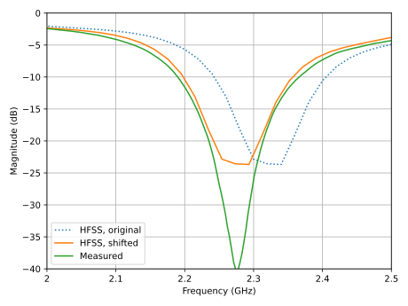
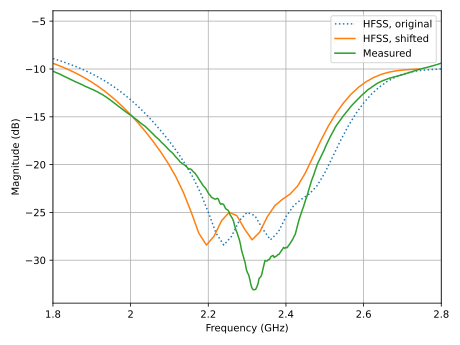
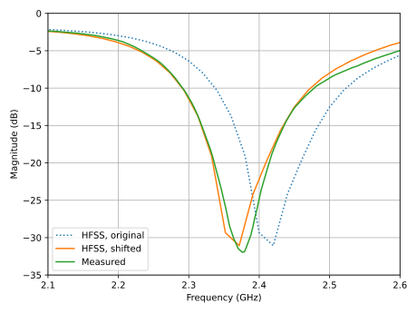
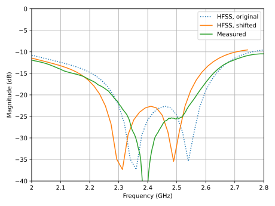

# Table of Contents

1.  [Измерения параметров патч-антенн S-диапазона](#org7d4961b)
    1.  [Патч-антенна на 2.32 ГГц](#orgce7a138)
        1.  [Измерения без резистора (R = $\infty$)](#orgc39a582)
        2.  [Измерения с резистором (R = 100 Ом)](#org905dc52)
    2.  [Патч-антенна на 2.42 ГГц](#org6cdca7e)
        1.  [Измерения без резистора (R = $\infty$)](#org6c6b1e6)
        2.  [Измерения с резистором (R = 100 Ом)](#orgb7b53d5)
    3.  [Оценка коэффициента усиления антенн](#org08b523f)
    4.  [Заключение](#org0a8dc28)

# Измерения параметров патч-антенн S-диапазона

## Патч-антенна на 2.32 ГГц

Измерения патч-антенны проводились в двух режимах:

1.  Без резистора в цепи делителя Вилкинсона (R = $\infty$)
2.  С резистором

Без резитора измерения S-параметров указывают на ширину полосы самой
антенны. С припаянным резистором измеряется ширина полосы не антенны,
а самого делителя (она больше ширины полосы антенны).

Измерения показали, что резонансная частота антенны отличается от
расчетной примерно на 2 процента. Поэтому для справки на графиках
зависимости коэффициента отражения от частоты приведены как исходные
расчетные данные, так и смещенные на эти самые 2 процента по частоте.

### Измерения без резистора (R = $\infty$)

Figure 1: Патч 2.32 ГГц, R = \(\infty\)

<table border="2" cellspacing="0" cellpadding="6" rules="groups" frame="hsides">
<caption class="t-above">Table 1: Полосы частот антенны 2.32 ГГц (R = \(\infty\))</caption>

<colgroup>
<col  class="org-left" />

<col  class="org-right" />

<col  class="org-right" />

<col  class="org-right" />
</colgroup>
<thead>
<tr>
<th scope="col" class="org-left">&#xa0;</th>
<th scope="col" class="org-right">Центральная частота, ГГц</th>
<th scope="col" class="org-right">Ширина полосы, ГГц</th>
<th scope="col" class="org-right">Ширина полосы, %</th>
</tr>
</thead>
<tbody>
<tr>
<td class="org-left">HFSS, original</td>
<td class="org-right">2.3220</td>
<td class="org-right">0.1060</td>
<td class="org-right">4.5650</td>
</tr>

<tr>
<td class="org-left">HFSS, shifted</td>
<td class="org-right">2.2756</td>
<td class="org-right">0.1039</td>
<td class="org-right">4.5650</td>
</tr>

<tr>
<td class="org-left">Measured</td>
<td class="org-right">2.2748</td>
<td class="org-right">0.1125</td>
<td class="org-right">4.9456</td>
</tr>
</tbody>
</table>

### Измерения с резистором (R = 100 Ом)

Figure 2: Патч 2.32 ГГц, R = 100 Ohm

<table border="2" cellspacing="0" cellpadding="6" rules="groups" frame="hsides">
<caption class="t-above">Table 2: Полосы частот антенны 2.32 ГГц (R = 100 Ohm)</caption>

<colgroup>
<col  class="org-left" />

<col  class="org-right" />

<col  class="org-right" />

<col  class="org-right" />
</colgroup>
<thead>
<tr>
<th scope="col" class="org-left">&#xa0;</th>
<th scope="col" class="org-right">Центральная частота, ГГц</th>
<th scope="col" class="org-right">Ширина полосы, ГГц</th>
<th scope="col" class="org-right">Ширина полосы, %</th>
</tr>
</thead>
<tbody>
<tr>
<td class="org-left">HFSS, original</td>
<td class="org-right">2.3100</td>
<td class="org-right">0.5280</td>
<td class="org-right">22.8571</td>
</tr>

<tr>
<td class="org-left">HFSS, shifted</td>
<td class="org-right">2.2638</td>
<td class="org-right">0.5174</td>
<td class="org-right">22.8571</td>
</tr>

<tr>
<td class="org-left">Measured</td>
<td class="org-right">2.2763</td>
<td class="org-right">0.5385</td>
<td class="org-right">23.6573</td>
</tr>
</tbody>
</table>

## Патч-антенна на 2.42 ГГц

### Измерения без резистора (R = $\infty$)

Figure 3: Патч 2.42 ГГц, R = inf

<table border="2" cellspacing="0" cellpadding="6" rules="groups" frame="hsides">
<caption class="t-above">Table 3: Полосы частот антенны 2.42 ГГц (R = infty)</caption>

<colgroup>
<col  class="org-left" />

<col  class="org-right" />

<col  class="org-right" />

<col  class="org-right" />
</colgroup>
<thead>
<tr>
<th scope="col" class="org-left">&#xa0;</th>
<th scope="col" class="org-right">Центральная частота, ГГц</th>
<th scope="col" class="org-right">Ширина полосы, ГГц</th>
<th scope="col" class="org-right">Ширина полосы, %</th>
</tr>
</thead>
<tbody>
<tr>
<td class="org-left">HFSS, original</td>
<td class="org-right">2.4250</td>
<td class="org-right">0.1160</td>
<td class="org-right">4.7835</td>
</tr>

<tr>
<td class="org-left">HFSS, shifted</td>
<td class="org-right">2.3765</td>
<td class="org-right">0.1137</td>
<td class="org-right">4.7835</td>
</tr>

<tr>
<td class="org-left">Measured</td>
<td class="org-right">2.3768</td>
<td class="org-right">0.1155</td>
<td class="org-right">4.8596</td>
</tr>
</tbody>
</table>

### Измерения с резистором (R = 100 Ом)

Figure 4: Патч 2.42 ГГц, R = 100 Ohm

<table border="2" cellspacing="0" cellpadding="6" rules="groups" frame="hsides">
<caption class="t-above">Table 4: Полосы частот антенны 2.42 ГГц (R = 100 Ohm)</caption>

<colgroup>
<col  class="org-left" />

<col  class="org-right" />

<col  class="org-right" />

<col  class="org-right" />
</colgroup>
<thead>
<tr>
<th scope="col" class="org-left">&#xa0;</th>
<th scope="col" class="org-right">Центральная частота, ГГц</th>
<th scope="col" class="org-right">Ширина полосы, ГГц</th>
<th scope="col" class="org-right">Ширина полосы, %</th>
</tr>
</thead>
<tbody>
<tr>
<td class="org-left">HFSS, original</td>
<td class="org-right">2.4215</td>
<td class="org-right">0.4290</td>
<td class="org-right">17.7163</td>
</tr>

<tr>
<td class="org-left">HFSS, shifted</td>
<td class="org-right">2.3731</td>
<td class="org-right">0.4204</td>
<td class="org-right">17.7163</td>
</tr>

<tr>
<td class="org-left">Measured</td>
<td class="org-right">2.3843</td>
<td class="org-right">0.4815</td>
<td class="org-right">20.1950</td>
</tr>
</tbody>
</table>

## Оценка коэффициента усиления антенн

Две антенны размещались на расстоянии около 1 метра друг от друга и
подключались к портам векторного анализатора цепей. Далее вариацией
взаимного поворота антенн и высоты установки подбиралось положение,
максимизирующее коэффициент передачи S21.

Для одинаковых антенн по формулу Фрииса можно оценить значение
коэффициента усиления:

\begin{equation*}
G = \cfrac{1}{2} \left(S_{21} - 20 \lg{\cfrac{\lambda}{4 \pi D}}\right)
\end{equation*}

Полученное в результате измерений значение (5..6 дБи) хорошо
согласуется с расчетным (5.7 дБи).

## Заключение

Обе антенны имеют похожие характеристики:

1.  Ширина полосы антенны без делителя Вилкинсона: 5 процентов
2.  Ширина полосы делителя: 20 процентов
3.  Резонансные частоты отличаются от расчетных на 2 процента в меньшую сторону
4.  Предварительно подтвержден коэффициент усиления антенн

По итогу &#x2013; требуется коррекция размера патч-антенн с учетом
фактической резонансной частоты.

