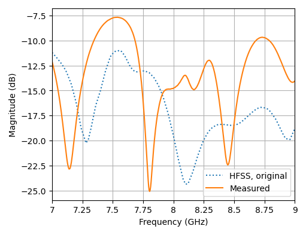

# Table of Contents

1.  [Измерения параметров антенной решетки 4x4 с центральной частотой 8.2 ГГц](#orgb2e8c08)
    1.  [Измерение коэффициента отражения](#orgf01c21d)
    2.  [Измерение коэффициента усиления](#org9d039ff)

# Измерения параметров антенной решетки 4x4 с центральной частотой 8.2 ГГц

## Измерение коэффициента отражения

Для измерения использовался векторный анализатор цепей Anritsu MS4644A
(серийный номер 091245).

Были учтены следующие факторы:

1.  Влияние SMP-разъема на частотах выше 6 ГГц оказывается
    существенным. Для его минимизации требуется либо металлизация торца
    платы (что не было выполнено на текущем этапе), что позволяет
    обеспечить надежный контакт внешней части разъема с земляной
    плоскостью платы, либо исключение этого разъема.
    1.  Для измерений жесткий коаксиальный кабель припаивался
        непосредственно к микрополосковой линии на плате. Диэлектрик на
        краю платы при этом частично удалялся, чтобы вскрыть полигон
        "земли", к которому припаивалась оболочка кабеля.
    2.  Для устранения влияния подводящего кабеля проводилась ручная
        калибровка векторного анализатора непосредственно с пристыкованным
        кабелем. Вместо исследуемой антенны на свободном конце кабеля
        последовательно создавались ситуации холостого хода, короткого
        замыкания (припаивался короткий отрезок провода) и согласованной
        нагрузки (ее роль выполнял 50-оммный smd-резистор размером 0402,
        припаиваемый между центральной жилой и оплеткой кабеля)

Figure 1: Коэффициент отражения, R = 100 Ом

Результаты измерений антенны с запаянными резисторами делителей
Вилкинсона (100-оммные) приведены на [1](#org49906ec). Видно, что
измеренная кривая смещена на 150 МГц относительно расчетной, что
согласуются с результатами измерений патч-антенн и говорит о
необходимости внесения корректировки в использованное при расчете
значение диэлектрической константы подложки (3.38).

## Измерение коэффициента усиления

Схема аналогична применявшейся для патч-антенн: одинаковые антенны
подключаются к двум портам векторного анализатора цепей и помещаются
на стойках на некотором удалении друг от друга. Изменяя углы установки
антенн, добиваются максимума коэффициента передачи между антеннами
S21, а полученный коэффициент пересчитывают в КУ антенны по формуле
Фрииса. Отличие заключается только в том, что для этих измерений
дополнительные кабели не использовались, т.е. их влияние уже исключено
на этапе калибровки анализатора.

<table id="org51244a3" border="2" cellspacing="0" cellpadding="6" rules="groups" frame="hsides">
<caption class="t-above">Table 1: Данные по измерению коэффициента усиления антенной решетки</caption>

<colgroup>
<col  class="org-left" />

<col  class="org-left" />
</colgroup>
<thead>
<tr>
<th scope="col" class="org-left">Параметр</th>
<th scope="col" class="org-left">Значение</th>
</tr>
</thead>
<tbody>
<tr>
<td class="org-left">Расстояние между антеннами</td>
<td class="org-left">65 см</td>
</tr>

<tr>
<td class="org-left">Частота</td>
<td class="org-left">8.04 ГГц</td>
</tr>

<tr>
<td class="org-left">Коэффициент в формуле Фрииса</td>
<td class="org-left">-46.7 дБ</td>
</tr>

<tr>
<td class="org-left">Измеренный S21</td>
<td class="org-left">-16.5 дБ</td>
</tr>

<tr>
<td class="org-left">Измеренный КУ</td>
<td class="org-left">15.1 дБи</td>
</tr>

<tr>
<td class="org-left">Расчетный КУ</td>
<td class="org-left">14 дБи</td>
</tr>
</tbody>
</table>

Измеренный КУ получился несколько выше расчетного. Связано это с двумя факторами:

1.  Измерения проводились не в безэховой камере (влияние переотражений)
2.  Антенны расположены слишком близко друг к другу (границы зон
    Френеля и Фраунгофера $2D^2/\lambda$ = 150 мм) &#x2013; сама формула для
    передачи энергии в таких условиях носит приближенный характер.

